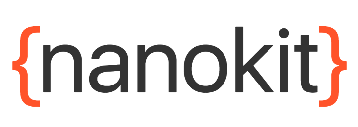

<div>
  
</div>
<div align="center">
  <strong>Modular React Native Component library</strong>
</div>
<br>
<div align="center">
  <a href="https://npmjs.org/package/nanokit">
    
  </a>
  <a href="https://npmjs.org/package/nanokit">
  
  </a>
  <a href="https://github.com/feross/standard">
    
  </a>
  <a href="https://github.com/prettier/prettier">
    
  </a>
  <a href="https://travis-ci.org/tiaanduplessis/nanokit">
    
  </a>
  <a href="https://github.com/tiaanduplessis/nanokit/blob/master/LICENSE">
    
  </a>
  <a href="http://makeapullrequest.com">
    
  </a>
</div>
<br>
<div align="center">
  <a href="https://github.com/tiaanduplessis/nanokit/watchers">
    
  </a>
  <a href="https://github.com/tiaanduplessis/nanokit/stargazers">
    
  </a>
  <a href="https://twitter.com/intent/tweet?text=Check%20out%20nanokit!%20https://github.com/tiaanduplessis/nanokit%20%F0%9F%91%8D">
    
  </a>
</div>
<br>
<div align="center">
  Built with ❤︎ by <a href="https://github.com/tiaanduplessis">tiaanduplessis</a> and <a href="https://github.com/tiaanduplessis/nanokit/contributors">contributors</a>
</div>

<h2>Table of Contents</h2>
<details>
  <summary>Table of Contents</summary>
  <li><a href="#about">About</a></li>
  <li><a href="#modules">Modules</a></li>
  <li><a href="#install">Install</a></li>
  <li><a href="#usage">Usage</a></li>
  <li><a href="#contribute">Contribute</a></li>
  <li><a href="#license">License</a></li>
</details>

## About

A hyper modular set of basic React Native components that can be seperately or together.

## Modules

Modules currently included:

- [nanokit-button](https://github.com/tiaanduplessis/nanokit-button)
- [nanokit-spinner-overlay](https://github.com/tiaanduplessis/nanokit-spinner-overlay)
- [nanokit-card](https://github.com/tiaanduplessis/nanokit-card)
- [nanokit-statusbar](https://github.com/tiaanduplessis/nanokit-statusbar)
- [nanokit-container](https://github.com/tiaanduplessis/nanokit-container)


## Install

```sh
$ npm install nanokit
# OR
$ yarn add nanokit
```

## Usage

```js
import { Container, Button } from 'nanokit'

// And use
```

See the respective [sub-modules](modules) for usage instructions.

## Contributing

Contributions are welcome!

1. Fork it.
2. Create your feature branch: `git checkout -b my-new-feature`
3. Commit your changes: `git commit -am 'Add some feature'`
4. Push to the branch: `git push origin my-new-feature`
5. Submit a pull request :D

Or open up [a issue](https://github.com/tiaanduplessis/nanokit/issues).

## License

Licensed under the MIT License.
